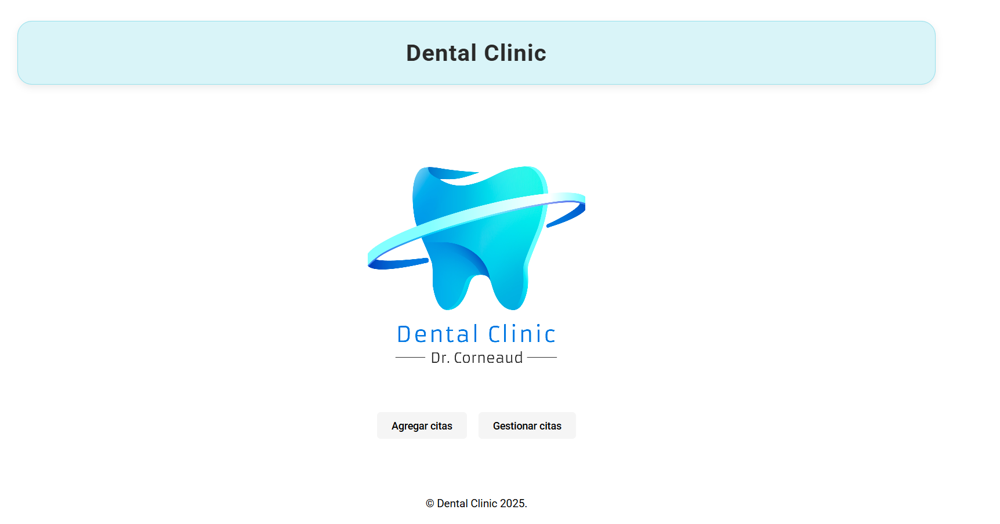
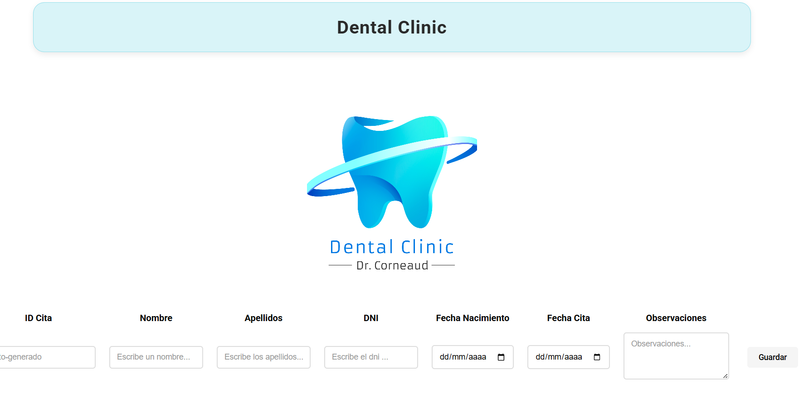
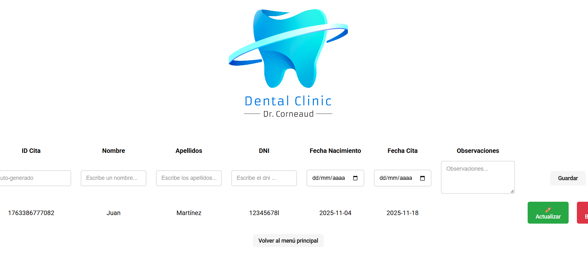
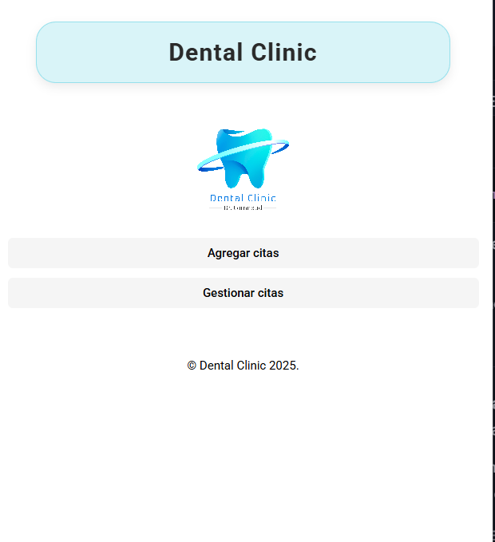

# Trabajo - Enfoque DevClient - Medac

Proyecto cliente (front-end) para la gestión de citas de una clínica dental. Aplicación escrita en HTML, CSS y JavaScript (sin frameworks) que permite crear, mostrar, actualizar y borrar citas usando cookies del navegador para persistencia.

**Resumen rápido**
- **Tecnologías:** HTML5, CSS3, JavaScript (ES6), Cookies para persistencia local.
- **Estructura:** Páginas estáticas y módulos JS separados por funcionalidad: agregar citas, gestionar (mostrar/actualizar/borrar) citas.








**Características principales**
- Crear cita: formulario con validación (nombre, apellidos, DNI, fecha de nacimiento, fecha de cita y observaciones).
- ID único por cita: se genera automáticamente al crear la cita.
- Mostrar citas: tabla con columnas (ID Cita, Nombre, Apellidos, DNI, Fecha Nacimiento, Fecha Cita, Observaciones, Acciones).
- Actualizar cita: rellenar formulario con los datos existentes, editar y guardar.
- Borrar cita: eliminar una cita concreta.
- Validaciones incluidas: formato de DNI (8 dígitos + letra), campos obligatorios, la fecha de cita no puede ser anterior a hoy, comprobación de fecha de nacimiento.
- Interfaz responsiva y estilos consistentes (CSS con media queries).

**Arquitectura y archivos clave**
- Raíz:
	- `index.html` — página principal / menú.
- Carpeta `agregarcita/`:
	- `index.html` — pantalla para crear citas.
	- `js/crearCita.js` — lógica para validar y crear citas (genera `idCita`).
	- `js/script.js` — manejador de eventos del formulario en agregar.
- Carpeta `gestionarcita/`:
	- `index.html` — pantalla para listar y gestionar citas.
	- `js/mostrarCitas.js` — lee cookies, renderiza la tabla y abre el formulario de actualización.
	- `js/crearCita.js` — (duplicado para crear desde esta página si procede).
	- `js/actualizarCita.js` — lógica para actualizar los datos guardados.
	- `js/borrarCita.js` — elimina la cookie correspondiente a una cita.
	- `js/script.js` — manejador de eventos en la página de gestión.
- `css/style.css` — estilos globales y responsive.
- `img/` — imágenes (logo, etc.).

**Formato de almacenamiento**
- Cada cita se guarda en una cookie bajo la clave `idCita` con el valor como JSON. Ejemplo de objeto guardado:

```json
{
	"idCita": "1731753245123",
	"nombre": "María",
	"apellidos": "Pérez",
	"dni": "12345678A",
	"fecnac": "1990-05-10",
	"fechaCita": "2025-11-20",
	"observaciones": "Revisión dental"
}
```

**Uso rápido**
- Abrir `index.html` desde la raíz y usar los enlaces al formulario de `Agregar cita` o `Gestionar citas`.
- En `Agregar cita`, completar los campos y pulsar `Guardar`.
- En `Gestionar citas`, usar los botones `Actualizar` y `Borrar` en cada fila.

**Consideraciones y limitaciones**
- Persistencia: basada en cookies del navegador; no es adecuada para producción ni para grandes volúmenes de datos.
- Seguridad y privacidad: los datos quedan almacenados localmente en el navegador. No hay cifrado ni control de acceso.
- Multiusuario y sincronización: no soportado (datos locales por navegador/cliente).

**Herramientas y decisiones técnicas**
- No se ha usado ningún framework: código vanilla JS para mantener simplicidad y facilidad de despliegue.
- Validación del lado cliente en `crearCita.js` para mejorar UX.
- ID de cita: generado mediante timestamp para garantizar unicidad en el cliente.

**Siguientes mejoras sugeridas**
- Mover la persistencia a backend (API + base de datos) para uso multiusuario y seguro.
- Sustituir cookies por `localStorage` o IndexedDB si se quiere más capacidad y mejor manejo.
- Añadir tests unitarios para la lógica de validación y manejo de cookies.


